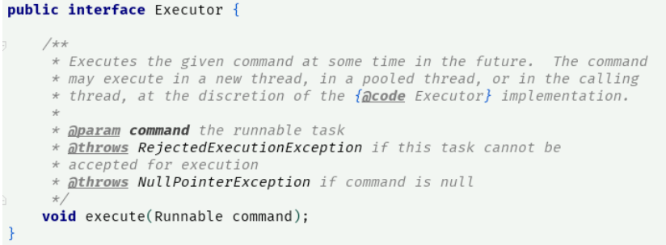

命令模式：将需要执行的流程封装成一个任务（命令），然后提交给执行器（命令执行者）执行。

例如：JDK 线程池里的 Execultor 就是采用了命令模式，Executor 是命令执行者，Runnable 是命令，Executor 里的 execute 方法传入的参数就是 Runnable，如下：

Runnable 负责定义任务的流程，Execultor 负责执行任务命令。

模式分析：

1、命令模式和策略模式，我觉得完全可以作为一种模式。根本就是新瓶换旧酒。同样都是就处理流程集中并封装到一个对象里（策略和任务），然后由执行器负责执行。

2、将执行动作和各种处理流程分离，便于问题定位和维护。